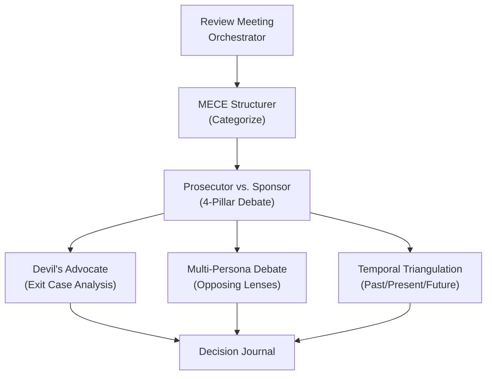

# Review Meeting Structure (Investment Committee Format)

A standard operating procedure for running a periodic portfolio review meeting, in the style
of an institutional Investment Committee (IC) session, adapted for a single decision-maker
working with an AI sparring partner instead of a multi-person committee. The format itself
(governance framing, time-boxed agenda, structured debate, mandatory documentation) is
borrowed from institutional practice; nothing here depends on any specific tool or data
source.

**Duration:** 45 to 90 minutes per session. **Frequency:** quarterly for a full review,
monthly for a lighter health check, on-demand for a single-position crisis.

## 1. Purpose

The review meeting is governance, not investing. Its job is to make sure the thesis behind
every position is current, has been challenged, and is documented, not to micromanage
individual trades.

> "The best performing investment committees recognize their primary role is one of
> governance, not investing." (Charles D. Ellis, on the Yale Endowment's IC practice)

## 2. Pre-meeting preparation

Before the meeting starts, assemble a "board pack": current holdings, latest available
research (earnings, filings, analyst notes, whatever your own pipeline produces), and a
quality/valuation snapshot per position if you have one. None of this needs to be automated
to run the meeting; it just needs to exist before Block 2 starts, because the debate below
depends on having current data in front of you.

## 3. Meeting agenda (60-minute standard)

### Block 1: Portfolio pulse (10 min)

- Overall health check: a simple traffic-light read on the portfolio as a whole.
- MECE categorization of all positions (see [mece-structurer.md](mece-structurer.md)):
  bucket every position by strategy, signal, and required action.
- Any alerts or flags that have come up since the last review.

### Block 2: Prosecutor vs. sponsor debate (25 min)

**Scope:** your largest positions by allocation, plus anything flagged in Block 1.

For each position under review, run the 4-pillar rapid assessment:

```
┌──────────────────────────────────────────────────────────┐
│  THE 4-PILLAR RAPID ASSESSMENT                            │
│                                                           │
│  1. QUALITY          → your quality score, above/below bar│
│  2. VALUATION         → below / at / above fair value     │
│  3. QUALITATIVE       → thesis INTACT / WEAKENED / BROKEN │
│  4. STRATEGIC FIT     → position STRENGTHENED / UNCHANGED │
│                        / WEAKENED                          │
│                                                           │
│  All 4 green   → HOLD / ADD candidate                    │
│  Any red       → automatic review (Devil's Advocate)      │
│  2+ red        → exit-case analysis required              │
└──────────────────────────────────────────────────────────┘
```

**Debate format, per position:**

| Role | Responsibility |
|---|---|
| **Sponsor** | Presents the bull case: thesis, recent positive catalysts, quality strengths. |
| **Prosecutor** | Challenges with the bear case: thesis drift, sell triggers, headwinds, position sizing risk. |
| **Decision-maker** (human) | Final arbiter. Brings conviction, context, and gut check that the AI can't. |

**Resolution:** every debated position gets one verdict:

- **Thesis intact** → no action. Document the confidence level so a future review has a
  baseline to compare against.
- **Thesis weakened** → set an explicit review date (30/60/90 days out). Reduce if two or more
  pillars are red.
- **Thesis broken** → trigger a formal exit-case analysis (see
  [devils-advocate.md](devils-advocate.md) Mode A).

### Block 3: Deep dives (15 min)

Activate the relevant sub-tool based on what Block 2 surfaced:

| Situation | Tool to run | What it produces |
|---|---|---|
| Large unrealized loss on a held position | [devils-advocate.md](devils-advocate.md) Mode A | Structured exit-case analysis against the 15 sell triggers |
| A complex strategic call with no clean answer | [multi-persona-debate.md](multi-persona-debate.md) | A multi-persona debate and synthesis |
| Thesis is old (roughly a year or more untouched) | [temporal-triangulation.md](temporal-triangulation.md) | Past/present/future read on the thesis |
| You're expressing doubt but can't articulate why | [decision-journal.md](decision-journal.md) | Assumption identification, bias check |
| Analysis feels incomplete | [mece-structurer.md](mece-structurer.md) | Gap analysis: what are the unknown unknowns? |

### Block 4: Decisions and documentation (10 min)

1. Record every actionable decision as a decision journal entry (assumptions, biases,
   expected outcome).
2. Generate trade recommendations in a consistent format: Ticker, Action, Size, Rationale,
   Confidence, Review date.
3. Append the recommendations to whatever trade log or record you keep.
4. Set the next review date.

## 4. Post-meeting outputs

Whatever format works for you, a review session should leave behind at minimum: a written
summary of what was discussed and decided, a decision journal entry for each actionable item
(see [decision-journal.md](decision-journal.md)), and updated review dates for every
weakened-thesis position.

## 5. Special meeting types

### Emergency review (single-position crisis)

Skip Block 1 entirely; there's no need for a full portfolio pulse. Go straight to the
prosecutor/sponsor debate for the position in crisis. A Devil's Advocate session is mandatory.
The meeting must end with a decision: hold with explicit conditions, trim, or exit.

### Earnings-driven review

Focus only on positions where new earnings or guidance has come out since the last review.
Weight the discussion toward guidance changes and whether results beat or missed expectations,
not the full portfolio.

### Rebalancing / concentration review

Focus on concentration risk: how much of the portfolio sits in how few names, and whether
position sizes match conviction level. If you run more than one portfolio, also check for
unintentional overlap between them.

## 6. Quality gate (session checklist)

- [ ] Holdings snapshot is current, not stale data from a prior period.
- [ ] Quality/valuation data pulled for every position that has it available.
- [ ] MECE categorization done, no position left unassigned.
- [ ] Prosecutor/sponsor debate completed for the top positions plus anything flagged.
- [ ] 4-pillar assessment run for every debated position.
- [ ] A decision journal entry exists for every actionable item.
- [ ] Every trade recommendation carries an explicit review date.
- [ ] The trade log or record is updated with a reference to this session.
- [ ] The next review date is set before the session ends.

## 7. How the sub-tools connect



## 8. References

| Source | What it contributes |
|---|---|
| Charles D. Ellis, on the Yale Endowment's Investment Committee practice | The governance-vs-investing distinction that frames this entire meeting format |
| Institutional IC best-practice literature (widely published by endowment and family-office advisors) | Time-boxed debates, a standard multi-topic agenda, the idea of a committee chair as process owner rather than decision-maker |
